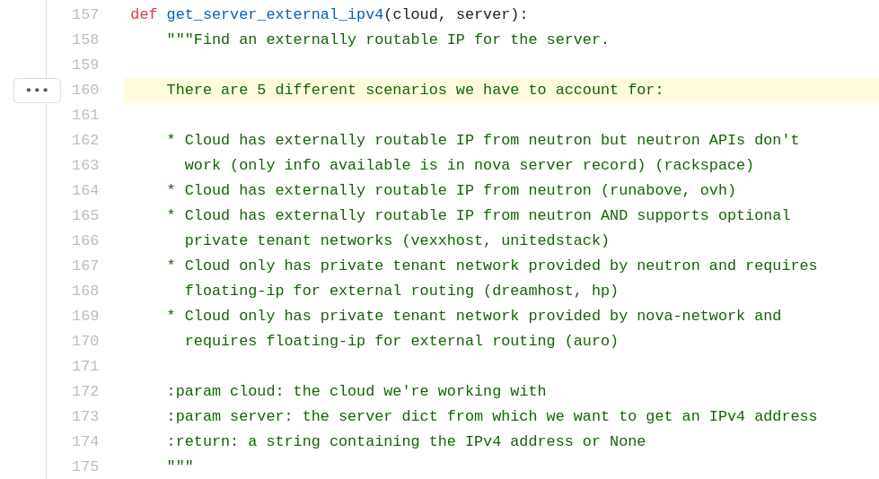
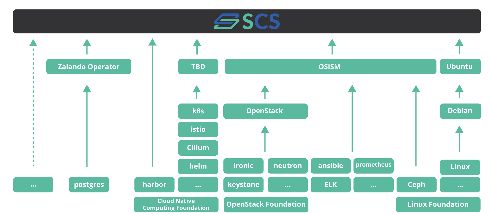
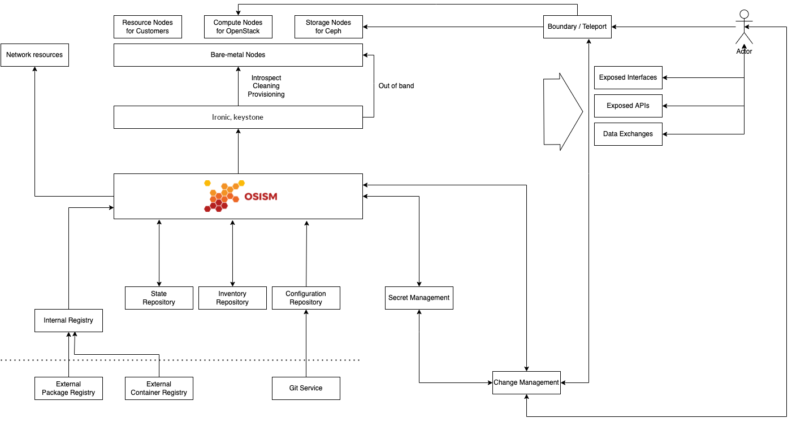

## Sovereign Cloud Stack

### SCS OSISM Hands-On Session

Felix Kronlage-Dammers

\<fkr@osb-alliance.com\> <!-- .element: style="color:black" -->

Mathias Fechner

\<fechner@osism.tech\> <!-- .element: style="color:black" -->

<!-- .slide: data-background-image="images/background.jpg" -->

Note:

#

Note:

### Optional Standards?!?

* Flavor Naming
    * SCS-2C:4:10n
	* SCS-2L:4:10n
	* ...
* Images

Note:

### OpenStack == OpenStack?

`openstacksdk/src/openstack/cloud/meta.py`

 <!-- .element: width="80%" -->

Note:

#### Upstream first

Note:

# OSISM

Note:

# 

Note:

