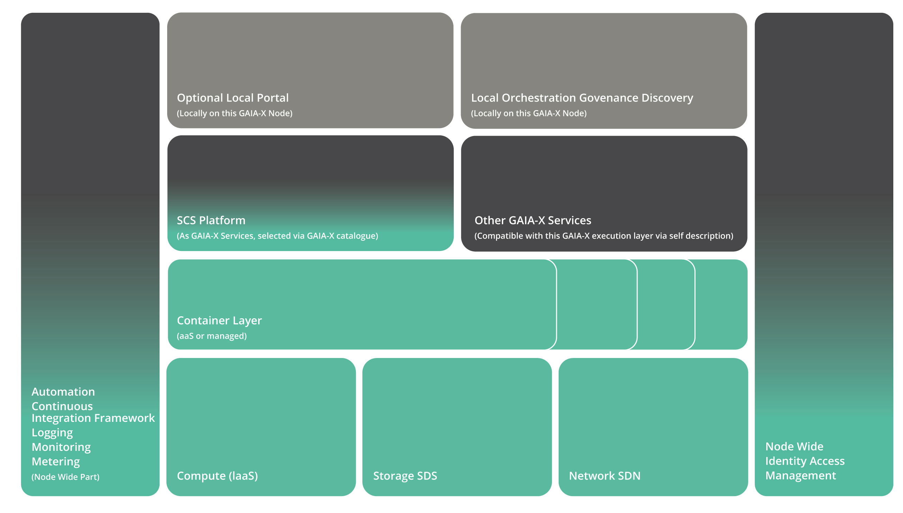
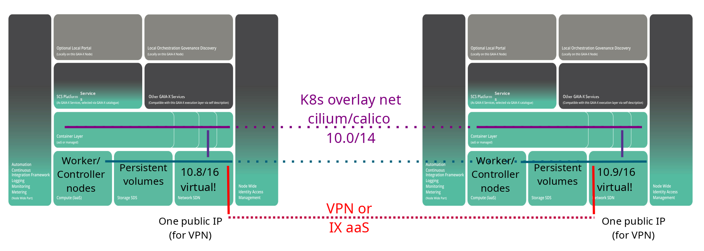
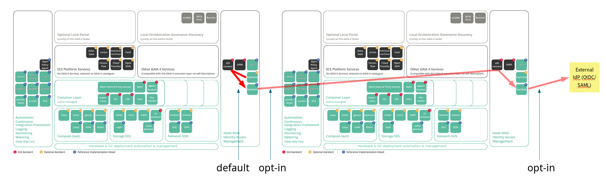
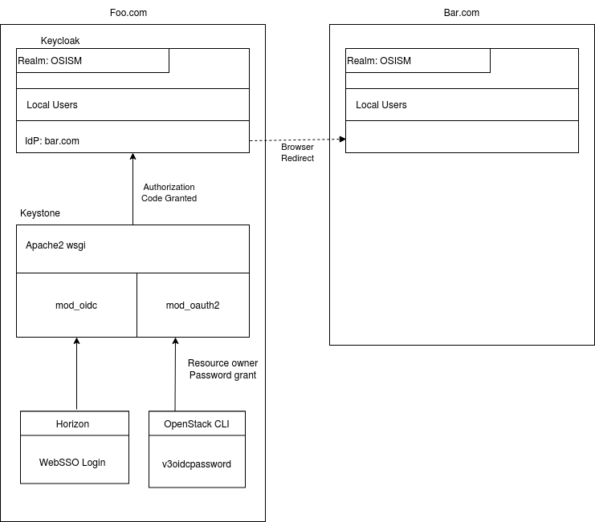
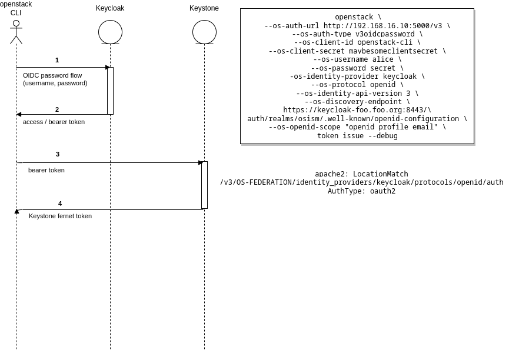

## Sovereign Cloud Stack

### Overview - GAIA-X Hackathon \#5

Eduard Itrich \<itrich@osb-alliance.com\> <!-- .element: style="color:black" -->

Felix Kronlage-Dammers \<fkr@osb-alliance.com\> <!-- .element: style="color:black" -->

Note:

<!-- .slide: data-background-image="images/background.jpg" -->

##

Note:

##

Note:

##

Note:

##

Note:

##

Note:

* Customers get an OpenStack domain (with one or several OpenStack projects and none to several k8s clusters)
  * User Management is per domain
  * Keystone can gets identities from local keycloak (via Open ID Connect Federation), customer owns a realm
  * Keycloak can be set up to accept identities from other keycloaks or other trusted IdPs (OIDC/SAML)

## 

 

Note:

## 

Note:
