## Sovereign <!-- .element: style="color:#50c3a5" -->
## Cloud Stack <!-- .element: style="color:#0f5fe1" -->

### Collaboration over Competition <!-- .element: style="color:#50c3a5" -->

Felix Kronlage-Dammers

\<fkr@osb-alliance.com\> <!-- .element: style="color:#50c3a5" -->

Note: special note for myself

<!-- .slide: data-background-image="images/background.jpg" -->


##

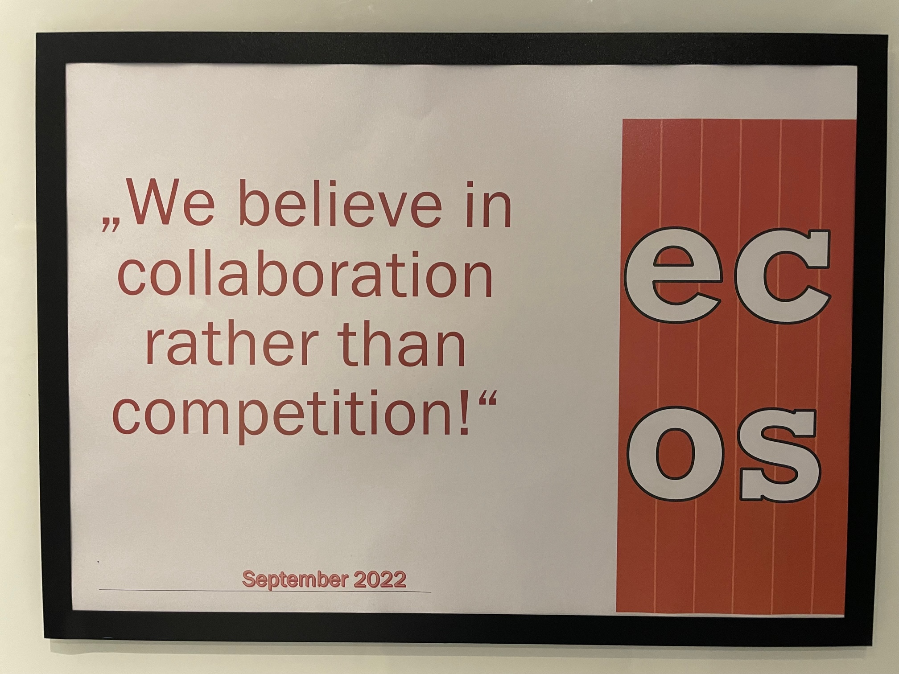


##

```
$ finger fkr

Login: fkr                    Name: Felix Kronlage-Dammers
Job: PO IaaS & Ops @ SCS      Where: OSB Alliance e.V.
E-Mail: fkr@osb-alliance.com  Twitter: @felixkronlage
```


## Die Vision


## 

Sovereign Cloud Stack (SCS) ist eine offene, föderierbare und modulare Cloud- und Containerplattform auf Basis von Open-Source-Software.


## Die Aufgabe


Nur Open-Source garantiert digitale Souveränität durch Interoperabilität, Transparenz und Unabhängigkeit von Ansprüchen Dritter und damit von wirtschaftlicher oder politischer Einflussnahme.


## 

Digitale Souveränität


#### SCS - mehr als nur Datensouveränität 

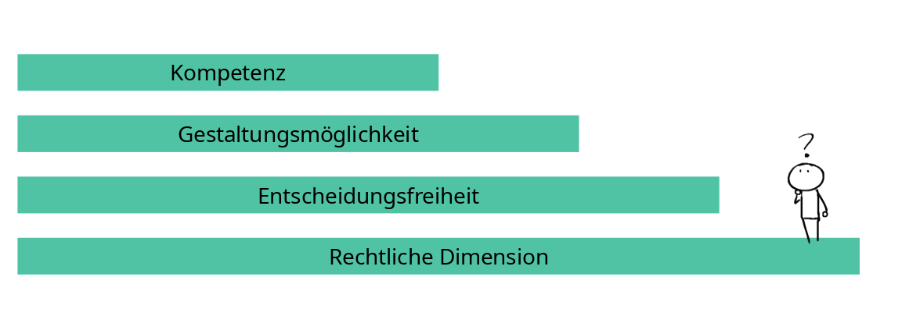


#### SCS - mehr als nur Datensouveränität 

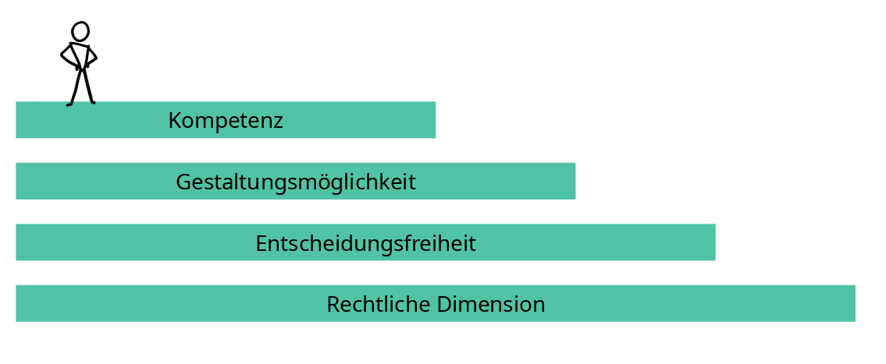


## Die Ziele

* Standardizierung <!-- .element: class="fragment" -->
* Zertifizierbarkeit <!-- .element: class="fragment" -->
* Transparenz <!-- .element: class="fragment" -->
* Nachhaltigkeit <!-- .element: class="fragment" -->
* Föderierung <!-- .element: class="fragment" -->


## Wer?


## 


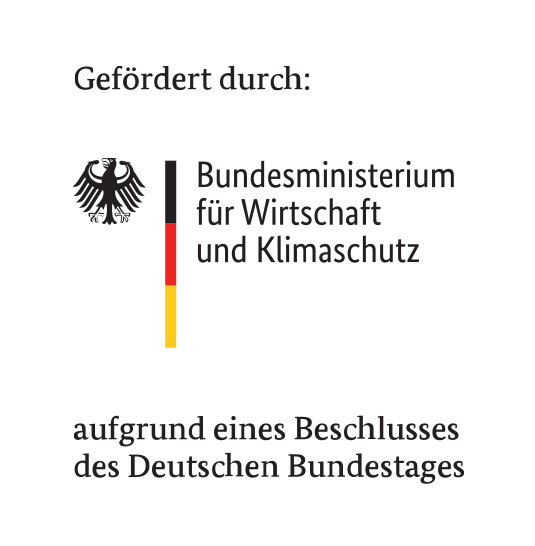 <!-- .element: class="fragment" -->


# 

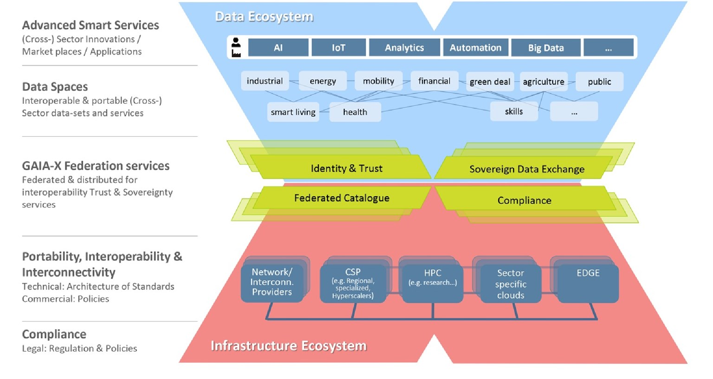


#

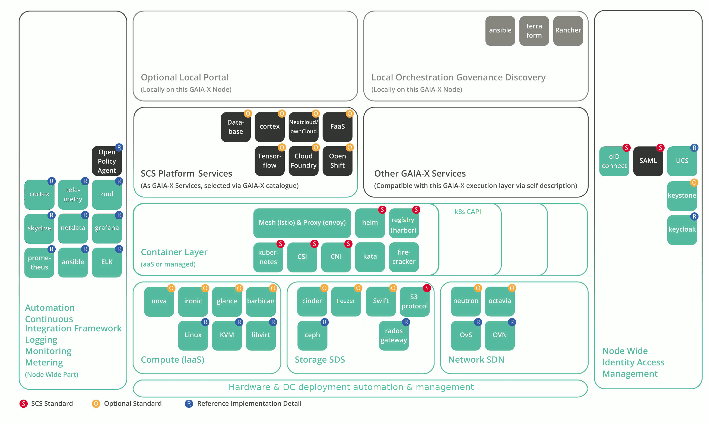


#

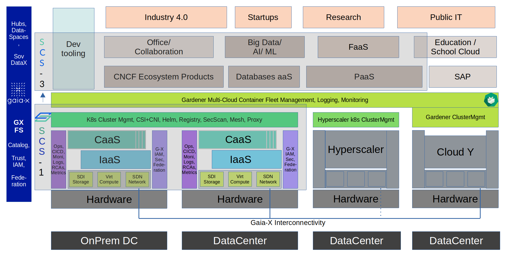


## 

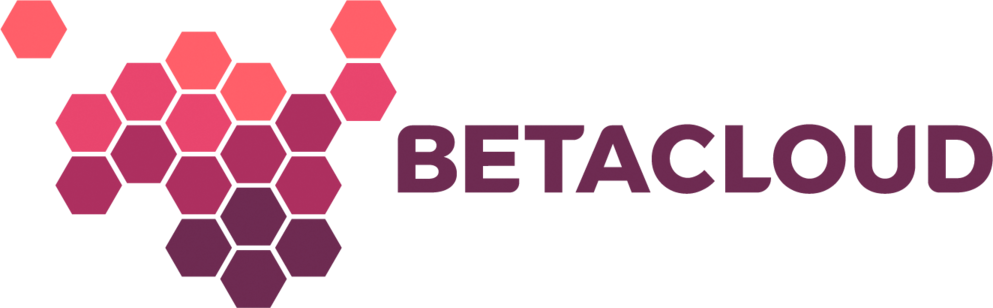 <!-- .element height="50%" width="30%" -->

 <!-- .element height="50%" width="30%" -->

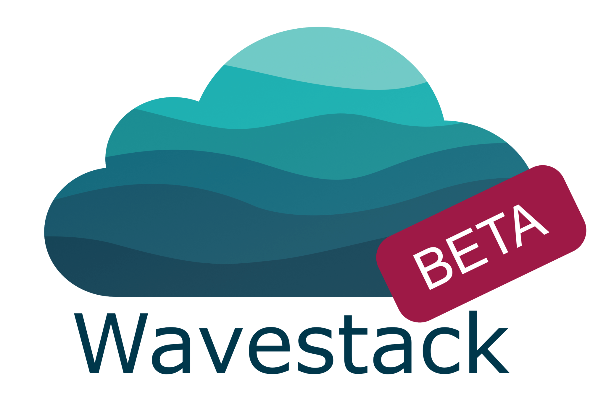 <!-- .element height="50%" width="30%" -->


#

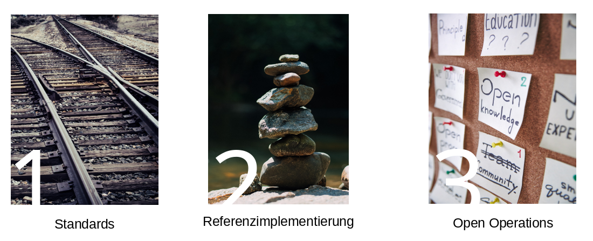


#

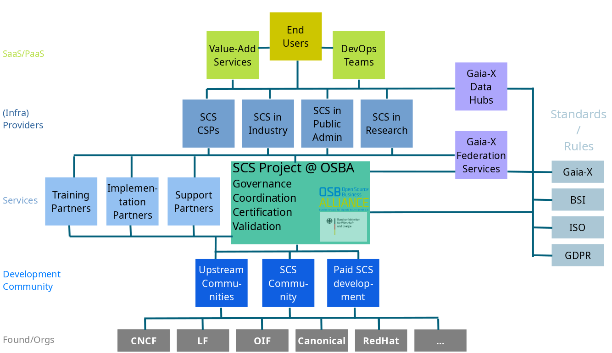
