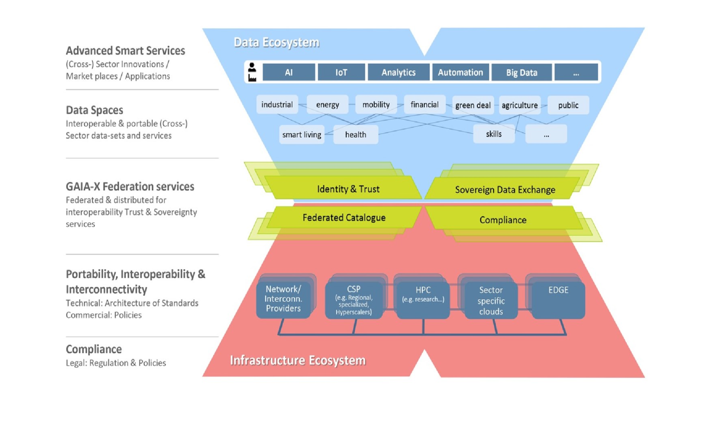
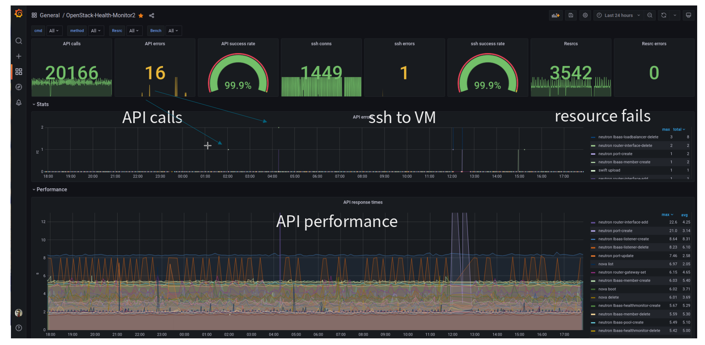

## Sovereign Cloud Stack

### Collaboration over Competition

Felix Kronlage-Dammers

\<fkr@osb-alliance.com\> <!-- .element: style="color:black" -->

Note:

<!-- .slide: data-background-image="images/background.jpg" -->


##

 <!-- .element height="50%" width="70%" -->

Note:


##

```
$ finger fkr

Login: fkr                    Name: Felix Kronlage-Dammers
Job: PO IaaS & Ops @ SCS      Where: OSB Alliance e.V.
E-Mail: fkr@osb-alliance.com  Twitter: @felixkronlage
```

Note:

## Die Vision


## 

> Sovereign Cloud Stack (SCS) ist eine offene, föderierbare und modulare Cloud- und Containerplattform auf Basis von Open-Source-Software.

Note:
* Hyperscaler dominieren den Markt


## Die Aufgabe


> Nur Open-Source garantiert digitale Souveränität durch Interoperabilität, Transparenz und Unabhängigkeit von Ansprüchen Dritter und damit von wirtschaftlicher oder politischer Einflussnahme.

Note:
* Abhängigkeiten (ökonomischer, strategischer oder juristischer Natur) → Digitalisierungshemmnis
* Zentrale Kontrolle über die Plattform und den verarbeiteten Daten
* Kontrolle und Wertschöpfung findet außerhalb Europas statt


## 

Digitale Souveränität

Note:


#### SCS - mehr als nur Datensouveränität 


#### SCS - mehr als nur Datensouveränität 


## Die Ziele

* Standardisierung <!-- .element: class="fragment" -->
* Zertifizierbarkeit <!-- .element: class="fragment" -->
* Transparenz <!-- .element: class="fragment" -->
* Nachhaltigkeit <!-- .element: class="fragment" -->
* Föderierung <!-- .element: class="fragment" -->


## Wer?


##

 <!-- .element: width="20%" -->

 <!-- .element: class="fragment" width="20%" -->

 <!-- .element: class="fragment" width="20%" -->

Note:
* Bundesverband digitale Souveränität
* Wirtschaftsverband mit mehr als 190 Mitgliedsunternehmen
* Interessensvertretung Open Source auf politischer Ebene


#

 <!-- .element: class="r-frame" -->


#


#### Cross Provider Cluster Networking


#


### Container Layer

Note:

* Cluster API - warum Cluster API
* Gardener?
* Referenz: OSS Health Check


### Optional Standards?!?

* Flavor Naming
    * SCS-2C:4:10n
	* SCS-2L:4:10n
	* ...
* Images


### OpenStack == OpenStack?

`openstacksdk/src/openstack/cloud/meta.py`

 <!-- .element: width="80%" -->


#### Upstream first


# OSISM


# 


## Wo stehen wir

* stetig wachsende Community
* halbjährliche Releases
* R0 - R2
* Deutsche Verwaltungscloud-Strategie


## Adaption


## 

 <!-- .element height="30%" width="30%" -->  <!-- .element height="30%" width="30%" -->

 <!-- .element height="30%" width="30%" -->


## Release 3

* Release kommende Woche Mittwoch (21.09.22)
* OpenStack Yoga
* Ceph Pacific / Quincy
* Support Kubernetes 1.24 / Cluster API 1.1.x
* User Federation
* LUKS und NBDE


## Wie funktioniert das Projekt?


#


Note:

- Angestellte OSBA
- Firmen Vergabepakete
- Public Money, Public Code
- Community -> Ueberleitung Zusammenarbeit


#
 <!-- .element: width="80%" -->

Note:

Teams erklaeren
SIGs erklaeren


## Mitmachen

* https://scs.community
* https://github.com/sovereigncloudstack
* https://matrix.to/#/#scs-general:matrix.org

Note:


# GAIA-X und SCS?


# 




# 


## Open Operations?


##

> Durch das Weitergeben und Dokumentieren von bewährten Praktiken zum Betrieb solcher Cloudumgebungen wird die Schwierigkeit, Clouddienste mit hoher Qualität zu liefern deutlich reduziert.


#

 <!-- .element height="50%" width="70%" -->

Note:

- Drei Beispiele geben
  * SIG Monitoring
  * Hackathon PCO OTC
  * Upgrade Session


### OpenStack Health Monitor



Note:


### Danke für die 20. Ausgabe der Kielux!

* https://scs.community
* https://github.com/sovereigncloudstack
* https://matrix.to/#/#scs-general:matrix.org

Note:

