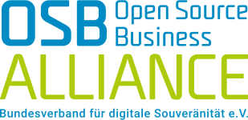

## Sovereign <!-- .element: style="color:#50c3a5" -->
## Cloud Stack <!-- .element: style="color:#0f5fe1" -->

### Collaboration over Competition <!-- .element: style="color:#50c3a5" -->

Felix Kronlage-Dammers

\<fkr@osb-alliance.com\> <!-- .element: style="color:#50c3a5" -->

Note: special note for myself

<!-- .slide: data-background-image="images/background.jpg" -->


##

 <!-- .element height="50%" width="70%" -->


##

```
$ finger fkr

Login: fkr                    Name: Felix Kronlage-Dammers
Job: PO IaaS & Ops @ SCS      Where: OSB Alliance e.V.
E-Mail: fkr@osb-alliance.com  Twitter: @felixkronlage
```


## Die Vision


## 

Sovereign Cloud Stack (SCS) ist eine offene, föderierbare und modulare Cloud- und Containerplattform auf Basis von Open-Source-Software.


## Die Aufgabe


Nur Open-Source garantiert digitale Souveränität durch Interoperabilität, Transparenz und Unabhängigkeit von Ansprüchen Dritter und damit von wirtschaftlicher oder politischer Einflussnahme.


## 

Digitale Souveränität


#### SCS - mehr als nur Datensouveränität 


#### SCS - mehr als nur Datensouveränität 


## Die Ziele

* Standardisierung <!-- .element: class="fragment" -->
* Zertifizierbarkeit <!-- .element: class="fragment" -->
* Transparenz <!-- .element: class="fragment" -->
* Nachhaltigkeit <!-- .element: class="fragment" -->
* Föderierung <!-- .element: class="fragment" -->


#

 <!-- .element: class="r-frame" -->


## Wer?


## 



 <!-- .element: class="fragment".element height="50%" width="30%" -->


# GAIA-X und SCS?


# 


# 


#


#


#


#


## 

 <!-- .element height="30%" width="30%" -->  <!-- .element height="30%" width="30%" -->

 <!-- .element height="30%" width="30%" -->


#


### OpenStack == OpenStack?

``` python
def get_server_external_ipv4(cloud, server):
    """Find an externally routable IP for the server.

    There are 5 different scenarios we have to account for:

    * Cloud has externally routable IP from neutron but neutron APIs don't
      work (only info available is in nova server record) (rackspace)
    * Cloud has externally routable IP from neutron (runabove, ovh)
    * Cloud has externally routable IP from neutron AND supports optional
      private tenant networks (vexxhost, unitedstack)
    * Cloud only has private tenant network provided by neutron and requires
      floating-ip for external routing (dreamhost, hp)
    * Cloud only has private tenant network provided by nova-network and
      requires floating-ip for external routing (auro)
```


### Open Source Business Alliance e.V.

* Bundesverband digitale Souveränität
* Wirtschaftsverband mit mehr als 190 Mitgliedsunternehmen
* Interessensvertretung Open Source auf politischer Ebene
